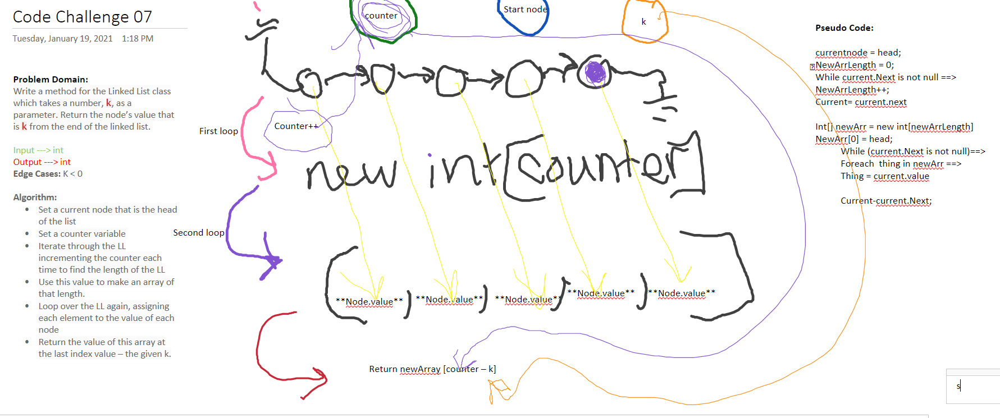

# Code Challenge 05
This Code Challenge introduces how to create LinkedList Classes, how to traverse them, and how to write unit tests for thier methods

## Challenge
- Create a Node class that has properties for the value stored in the Node, and a pointer to the next Node.
- Within your LinkedList class, include a head property. Upon instantiation, an empty Linked List should be created.
- Define a method called insert which takes any value as an argument and adds a new node with that value to the head of the list with an O(1) Time performance.
- Define a method called includes which takes any value as an argument and returns a boolean result depending on whether that value exists as a Node’s value somewhere within the list.
- Define a method called toString (or __str__ in Python) which takes in no arguments and returns a string representing all the values in the Linked List, formatted as:
"{ a } -> { b } -> { c } -> NULL"
- Any exceptions or errors that come from your code should be semantic, capturable errors. For example, rather than a default error thrown by your language, your code should raise/throw a custom, semantic error that describes what went wrong in calling the methods you wrote for this lab.
- Be sure to follow your language/frameworks standard naming conventions (e.g. C# uses PascalCasing for all method and class names).

## Approach & Efficiency
To traverse our LinkedLists we used both a while loop:Time: O(n) in our case, because it goes through the whole linked list everytime. Space: O(1) I think, becasue it doesn't return anything

## API
Public Methods:
toString, RecursiveToString, Includes, Insert

# Code Challenge 06
This Code Challenge introduces how to create LinkedList Classes, how to traverse them, and how to write unit tests for thier methods

## Challenge
Write the following methods for the Linked List class:

- .append(value) which adds a new node with the given value to the end of the list
- .insertBefore(value, newVal) which add a new node with the given newValue immediately before the first value node
- .insertAfter(value, newVal) which add a new node with the given newValue immediately after the first value node

## Approach & Efficiency
To traverse our LinkedLists we used both a while loop:Time: O(n) in our case, because it goes through the whole linked list everytime. Space: O(1) I think, becasue it doesn't return anything

## API
Public Methods:
toString, RecursiveToString, Includes, Insert, Append, InsertAfter, InsertBefore

# Code Challenge 07
This Code Challenge introduces how to create LinkedList Classes, how to traverse them, and how to write unit tests for thier methods

## Challenge
Write a method for the Linked List class which takes a number, k, as a parameter. Return the node’s value that is k from the end of the linked list. 

## Approach & Efficiency
Set a current node that is the head of the list 

Set a counter variable  

Iterate through the LL incrementing the counter each time to find the length of the LL 

Use this value to make an array of that length. 

Loop over the LL again, assigning each element to the value of each node 

Return the value of this array at the last index value – the given k. 
To traverse our LinkedLists we used both a while loop:Time: O(n) in our case, because it goes through the whole linked list everytime. Space: O(1) I think, becasue it doesn't return anything

## API
Public Methods:
toString, RecursiveToString, Includes, Insert, Append, InsertAfter, InsertBefore, KthFromEnd
