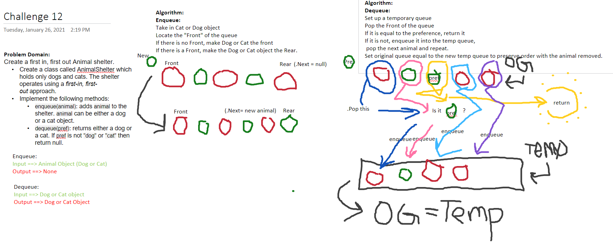

# Code Challenge 12
This code challenge has us working with Queue data structures, using Cat or Dog Objects instead of nodes.
## Challenge
Create a class called AnimalShelter which holds only dogs and cats. The shelter operates using a first-in, first-out approach.
Implement the following methods:
enqueue(animal): adds animal to the shelter. animal can be either a dog or a cat object.
dequeue(pref): returns either a dog or a cat. If pref is not "dog" or "cat" then return null.

## Approach & Efficiency
I ended up not using the temporary shelter to preserve the order like I intended, but used the rest of the algorithm the same way other than that.

## API
Public Methods:
Enqueue(), Dequeue()
