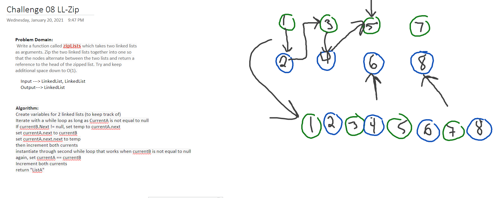

# Code Challenge 08
This Code Challenge introduces how to create LinkedList Classes, how to traverse them, and how to write unit tests for thier methods

## Challenge
Write a function called zipLists which takes two linked lists as arguments. Zip the two linked lists together into one so that the nodes alternate between the two lists and return a reference to the head of the zipped list. Try and keep additional space down to O(1). 
## Approach & Efficiency

## API
