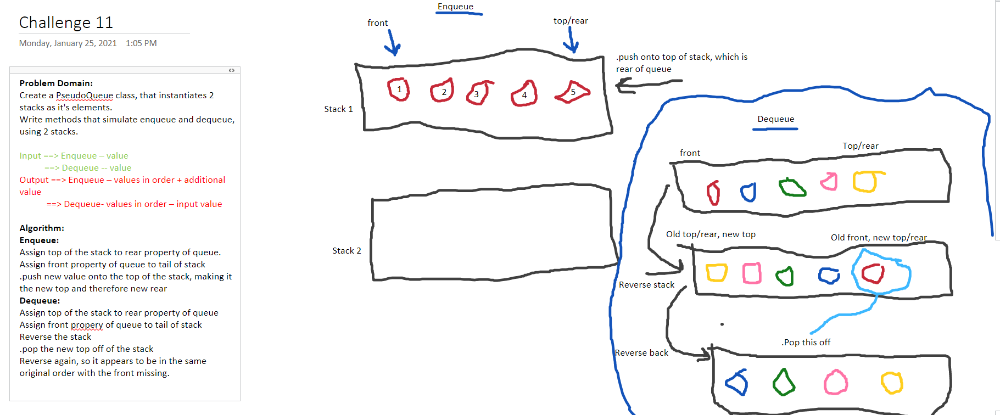

# Code Challenge 11

## Challenge
Create a brand new PseudoQueue class. Do not use an existing Queue. Instead, this PseudoQueue class will implement our standard queue interface (the two methods listed below), but will internally only utilize 2 Stack objects. Ensure that you create your class with the following methods:

## Approach & Efficiency

Public Methods:
- Pop(), Push(), IsEmpty(), Peek(), Enqueue(), Dequeue()
Public Classes:
- PseudoQueue, Stack
