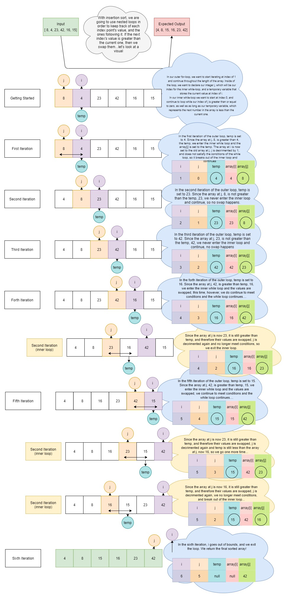

# Code Challenge 26: Insertion Sort

## Challenge
Create a blog article that shows the step-by-step algorithm for an Insertion Sort

## Approach and Efficiency

## API
Public Methods: InsertionSort()

# Code Challenge 28: Recursive QuickSort

## Challenge
Create a blog article that shows the step-by-step algorithm for a Quick Sort

## Approach and Efficiency

## API
Public Methods: QuickSort(), Partition(), Swap()

